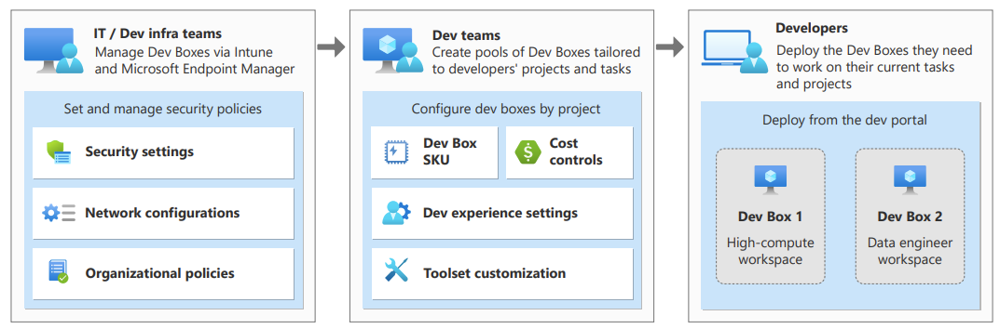

# DevBox + Deployment Environments Workshop
This lab will guide you through setting up an end-to-end demo environment for the Azure Deployment
Environments and Dev Box services.

## Table of content
- [DevBox + Deployment Environments Workshop](#devbox--deployment-environments-workshop)
  - [Table of content](#table-of-content)
  - [Deployment Environments](#deployment-environments)
    - [Create a resource group](#create-a-resource-group)
    - [Create a Dev Center](#create-a-dev-center)
    - [Create a KeyVault and Store a GitHub personal access token there](#create-a-keyvault-and-store-a-github-personal-access-token-there)
    - [Add a catalog to the Dev Center](#add-a-catalog-to-the-dev-center)
    - [Set up environment types](#set-up-environment-types)
    - [Set Up an Azure Deployment Environments project](#set-up-an-azure-deployment-environments-project)
    - [Create and access Environments](#create-and-access-environments)
    - [Use the Dev Center CLI to configure Environments](#use-the-dev-center-cli-to-configure-environments)
    - [Use the Developer Portal to create and manage environments](#use-the-developer-portal-to-create-and-manage-environments)
    - [Clean Up](#clean-up)
  - [DevBox](#devbox)
    - [Create Dev box definition](#create-dev-box-definition)
    - [Create a Network Connection](#create-a-network-connection)
    - [Add a permissions to dev center project](#add-a-permissions-to-dev-center-project)
    - [Create a Dev box pool](#create-a-dev-box-pool)
    - [Test the Environment](#test-the-environment)
    - [Clean Up](#clean-up-1)

## Deployment Environments

### Create a resource group

1. If you are not signed in already, sign into the Azure Portal and make sure you can access the subscription that you’d like to use for the duration of the lab. You should be an owner of this subscription.
2. Select the option to “Create a resource”, type “resource group”, and select the “Resource Group” option in the catalog.

3. Confirm the creation with “Create” and pick a name for the resource group that you’ll use for duration of the lab.
   - We picked “mtc-devportal-group” for the name
   - Ensure that you select a region where Dev Center resources are currently available and use this region throughout the lab
      - At the time of writing these regions are: Australia East, Japan East, Canada Central, UK South, West Europe, East US, East US 2, South Central US, West US 3
4. Confirm the creation of the resource by clicking “Review + create” and then “Create” on the next screen.

### Create a Dev Center  

1. Immediately return to the “Create a resource” screen and search for “Dev center” and select the “Dev Center” resource
2. Choose a name descriptive name for the Dev Center and place it in the same region as your resource group. Select the resource group you created earlier.

3. Confirm the details and the creation of the resource.
4. Once the Dev Center creation is complete navigate to the resource group that you created earlier and find the Dev Center resource
5. Click the Dev Center resource to open its resource blade
6. To allow the Dev Center to manage a catalog of environment templates and associated permissions, we need to assign a system managed identity to the resource.
7. To do this select “Identity” in the side bar and then switch the Dev Center’s system assigned identity on.
8. Confirm the process by clicking “Save”. You will see a pop up informing you that the resource will be registered in the Azure AD. Confirm the prompt and wait for the system-assigned identity object to be created.

9. The screen will now update to show an object id and a role assignment button

10. Click the “Azure role assignments” button. This will take you to a new blade where you can manage the permission assignments for the identity.
11. On the “Azure role assignments” blade click “Add role assignment”
12. Specify a Scope of “Subscription”
13. As the subscription target pick your current subscription
   - The Dev Center needs to have access to all the subscriptions you want to deploy to
14. As a role pick “Owner”
   - This allows the Dev Center to fully manage any environments that are created
15. Click “Save” to confirm

Once the assignment is complete a line confirming the assignment will show up in the “Azure role assignments” blade.

16. Use the links at the top of the page to navigate back to your Dev Center.

### Create a KeyVault and Store a GitHub personal access token there

Before you add a catalog, we need to store a personal access token as a key vault secret in Azure Key Vault and copy the secret identifier. For the purpose of our lab, we will use a GitHub personal access token but Azure DevOps is also supported. We will use the GitHub token to check the status of and consume content from a public repo on GitHub.

- Go to [https://github.com/settings/tokens](https://github.com/settings/tokens)
- If necessary, log in with your GitHub account
- Click on “Generate new token” and then select “Generate new token (classic)”
- On the next screen select a relatively short expiration time
- Select the following scopes
   - repo:status
   - repo_deployment
   - public_repo
- Add a note "mtc lab use" to give the token a descriptive name
- Click "Generate token"

On the next page make sure to copy your personal access token. It will only be displayed until you navigate away from the page. If you have connected your GitHub account to one or more of Microsoft’s GitHub organizations, then the organization where the repo is hosted will require you to configure an additional authorization on the token. To do this click “Configure SSO” next to the token and then “Authorize” next to the Azure organization. If you are not a member of the “Azure” organization you can use the “Authorize” option with any other Microsoft GitHub organization in the list. While the token remains the same after this step, completing this process enables it to access repos that you have read access to in this organization. You may need to repeat this step if your organizational token expires

Now it is time to return to the Azure Portal

You might want to temporarily paste the personal access token into Notepad while you complete the next steps to avoid loosing it.

- Once back in the Azure portal go to the “Create a resource” screen and then type “Key Vault” in the search field.
- On the search result screen select the option to create a KeyVault.
- Place the KeyVault into the same resource group and region that you have been using so far.
- Pick a descriptive name as well as the “Standard” pricing tier
- You will need to choose a unique name that is all lowercase in order to create the resource.
   - All other options can remain as specified by default
- Click “Review + create” and confirm the creation of the vault

The Key Vault resource should only take a few moments to show up in your existing resource group. Once it appears, click the resource to perform the next steps in its resource blade.

- First we need to configure an access policy that allows your Dev Center to read the secret that we are going to store in the KeyVault
- To do this select “Access policies” in the side bar and click “Create”

- On the “Permissions” screen select “Secret permissions > Get” and click “Next”
- On the “Principal” screen search for the name of your Dev Center resource and select it. Click “Next”

- Skip the “Application” screen by clicking “Next”
- Finally on the last screen click “Create”

Once back on the previous blade you should see that the Dev Center now has access to read secrets from the Key Vault.

Now it is time to place our PAT token into the key vault.

- Make sure you have still got the PAT token copied.
- Select “Secrets” in the side bar.
- Click “Generate/Import” in the Secrets blade.
- On the next screen configure the following options
   - Upload options: Manual
   - Name: GHPAT
   - Secret Value: copy your PAT here
   - Set activation date: no need to tick
   - Set expiration date: you can optionally set an expiration date for a time a few days out when the PAT will no longer be valid and/or necessary
   - Enabled: Yes

- Click “Create” and ensure that the new secret shows up in the Secrets blade

### Add a catalog to the Dev Center

Return to your Dev Center in the Azure Portal and select the “Catalogs” blade in the side bar. Click “Add” to add a new catalog.

For the lab we will use the Azure [Deployments Community catalog](https://github.com/arikbidny/deployment-environments). It already comes preconfigured with the necessary manifest files and templates

Configure the following options:

- Name: MtcTemplates
- Git clone URI: [https://github.com/arikbidny/deployment-environments.git](https://github.com/arikbidny/deployment-environments.git)
- Branch: main
- Folder Path: Environments
- Secret Identifier: https://{your KeyVault name}.vault.azure.net/secrets/GHPAT

If in doubt you can find your Key Vault URI on its resource blade.

Confirm the creation of the catalog. Within a few seconds the new catalog should start showing up on the blade.

- Select the item and click “Sync” to make the catalog items from the repository available to use.
- Take some time to [review the requirements for creating catalog items](https://learn.microsoft.com/en-us/azure/deployment-environments/configure-catalog-item) while the repository syncs with your Dev Center.

### Set up environment types

You can use environment types to categorize the Azure Deployment Environments that your development teams deploy into. You can apply different settings for each environment type.

- Select “Environment types” in the side bar to bring up the “Environment types” blade
   - Click “Create” to create an environment type
   - Call your environment type “Sandbox”
   - Repeat this process three more times creating three more environment types
      - “Dev”
      - “Test”
      - “Staging

An environment type that you add to your dev center is available in each project in the dev center, but environment types aren't enabled by default. When you enable an environment type at the project level, the environment type determines the managed identity and subscription that are used to deploy environments.

### Set Up an Azure Deployment Environments project

The next step is to create a project in your Dev Center that we can attach an environment type to. This in turn enables development teams to deploy templated infrastructure from the catalog to these environments.

- On your Dev Center resource blade select “Projects” in the side bar.
- Click “Create” to create a new project.
- On the next blade make sure the dev center resource that you have been using so far is selected and give your project a descriptive name.
- Confirm the creation of the resource.

You will land on a deployment screen. Select the resource group name to return to your resource group and select the Dev Center to return to the blade where you started.

Your project should now show up in the “Projects” blade. You can find the link to it in the side bar of your Dev Center’s resource blade. Click the project name in the balde to configure the project further

You will land on the resource blade for the project.

- In the sidebar select “Environment types” to configure the environment that the project has access to.
- Click **"Add"** to proceed

- For the purpose of this lab we’ll select the “Sandbox” environment type
- At least one identity (system-assigned or user-assigned) must be enabled for deployment identity. The identity is used to perform the environment deployment on behalf of the developer
- When it comes to Environment creator role(s) select “Contributor”. This will give developers deploying into the environment contributor access to the resources that they create.
- You can assign additional access via the “Additional access” drop downs if needed. This is not required for the lab.

Developers can only use the deployment environment specified in the project if they are given a specific RBAC role. For the purpose of this lab we will assign this role to you.

Developers can only use the deployment environment specified in the project if they are given a specific RBAC role. For the purpose of this lab we will assign this role to you.

- In the side bar select “Access control (IAM)”
- Select “Add > Add role assignment”.
- In Add role assignment, enter the following information, and then select Save:
   - On the Role tab, select Deployment Environments user.
      - A Dev Center project admin role is available for Dev Managers who need to also review the status of the project resource in the Azure portal.
   - On the Members tab, select your user identity.
- Click “Review + assign” and confirm the assignment on the summary page.

### Create and access Environments

In this exercise you will explore the steps to create and manage developer environments both from the developer portal and the Azure CLI

### Use the Dev Center CLI to configure Environments

For the next step you will require the Azure CLI, as well as a Dev Center extension package for it. Some of the steps outlined are not yet supported in Cloud Shell. We therefore recommend that you complete the following steps with a local installation of the Azure CLI.If you need to install or update Azure CLI, you can find instructions here: [https://learn.microsoft.com/en-us/cli/azure/install-azure-cli](https://learn.microsoft.com/en-us/cli/azure/install-azure-cli)

- Open a command prompt.
   - Use Admin mode if you’d like to install the extension for all users.
- Run the following command in Azure CLI once both services are set up on your machine:

`az extension add --source` [`https://fidalgosetup.blob.core.windows.net/cli-extensions/devcenter-0.1.0-py3-none-any.whl`](https://fidalgosetup.blob.core.windows.net/cli-extensions/devcenter-0.1.0-py3-none-any.whl)

The path might be easier to copy from here: [https://learn.microsoft.com/en-us/azure/deploymentenvironments/how-to-configure-use-cli](https://learn.microsoft.com/en-us/azure/deploymentenvironments/how-to-configure-use-cli)

- Type “y” to confirm that you’d like to install the extension and wait for the process to complete.
- Use the “az login” command to log in with the user account that you have been using in the lab so far.

Follow the instructions on screen to complete the login process.

- Once logged in you can use the following command to list all the Azure Deployment Environments projects that you have access to

`az graph query -q "Resources | where type =~ 'microsoft.devcenter/projects'"`

- If the project you created in the previous exercise does not show up use the following command to change your subscription

`az account set --subscription`

- You can use the following commands to list the environment type sand catalog items available to you in a specific project respectively

`az devcenter dev environment-type list --dev-center <name> --project-name <name>  -o table`

`az devcenter dev catalog-item list --dev-center <name> --project-name <name> -o table`

- Use the following command to create a Web App resource in a new environment in your project. Feel free to pick your environment name and use the “Sandbox” type.

az devcenter dev environment create --dev-center-name <devcenter-name>  --project-name <project-name> -n  --environment-type Sandbox --catalog-item-name WebApp–catalog-name CommunityTemplates

- By using the following command developers can access the endpoints of resources that are deployed in Azure Deployment Environments via the command line.

`az devcenter dev environment list --dev-center <devcenter-name> --project-name <project-name>`

- Take a moment to review other CLI commands available to you: [https://learn.microsoft.com/en-us/azure/deployment-environments/how-to-configure-use-cli](https://learn.microsoft.com/en-us/azure/deployment-environments/how-to-configure-use-cli)

Return to the Azure Portal and review your resource groups

- You should be able to see a resource group for the environment deployment that you just completed on the command line
- Return to the resource group you have used throughout the lab and select the project resources that you created earlier
- Select Environments in the side bar. All environments both failed and succeeded will show up here.
- Clicking “View Cost” for an environment takes you to the “Cost analysis and management” blades for the resource group used in conjunction with the environment.

You can delete environments via the CLI. A sample command is shown in Exercise 4 and in the CLI documentation linked on the previous page.

### Use the Developer Portal to create and manage environments

To deploy and manage environments using the developer portal head to:

[https://devportal.microsoft.com/](https://devportal.microsoft.com/)

When prompted to sign in use the account that you have been using for throughout this lab. You are accessing this portal as if you were a developer who has been assigned permissions to the environment.

Once singed in check if you can see the dropdown that allows you to pick between creating a Dev Box and an Azure Deployment Environment. If this is not visible use the link reference above again after logging in.

If you have already created an environment you will see it shown in this dashboard. Click “Environment Resources” to navigate to the environment.

Create a new environment by clicking the “+ New” drop down and choosing “New environment”.

A pop up appears asking you to provide an environment name and to select a catalog item. You can use the link to “view all catalog items” to browse your options.

Select the “FunctionApp” catalog item and call your environment “MyFunc”. Click “Create” to confirm.

Your environment will take a few moments to create. If you are logged into the Azure Portal in a different tab you can follow its creation in the portal.

- Clicking “View Cost” for an environment takes you to the “Cost analysis and management” blades for the resource group used in conjunction with the environment.

Return to the developer portal where you started the creation of your environment. To delete an environment from the Developer Portal, use the ellipsis menu “…” and the “Delete” option. Confirm that you would like to delete the environment in the following pop up.

### Clean Up

To keep costs to a minimum we recommend that you delete any environments that you have created during this lab.

You can use the following CLI command to do this

az devcenter dev environment delete --dev-center  <devcenter-name> --project-name <project-name>  --user-id "me" --name <environment-name>

You need to confirm the action by typing "y".

At this time, you can also clean up the Dev Center resources in your subscription. However, you may want to keep them around as they do not cost anything to maintain.

----

## DevBox

### Create Dev box definition

- On your Dev Center resource blade select “Dev box definitions” in the side bar.
- Select "Create"

- In "Create dev box definition", enter the following information, and then select Create:
   - Name: Choose a name
   - Image: Choose image from the image list
   - Image version: Latest
   - Compute: 4 vCPU, 16 GB RAM
   - Storage: 256 GB SSD

### Create a Network Connection

- Go to your resource group
- Select +Create
- Search for Virtual network and select Create
- In "Create virtual network", enter the following information, and then select "Review + create"
   - Resource group: select the same resource group as the dev center
   - Name: Choose a name
   - Region: Choose the same region as the dev center
- In "Search resources" search for Network Connections
- Select "+Create"

- In "Create a network connection", enter the following information, and then select "Review + create"
   - Domain join type: "Azure active directory join"
   - Subscription: Choose your subscription
   - Resource Group: select the same resource group as the dev center
   - Name: Choose a name
   - Virtual network and subnet: Choose a vnet you created in last step
- On your Dev Center resource blade select “Networking” in the side bar.
- Select "+Add"

- Select your connection ( Created in previous step )

- Click "Add"
- Wait until the "Running checks" finished

### Add a permissions to dev center project

- On your Dev Center resource blade select “Projects” in the side bar and choose your project.

- On your Project blade, in the side bar select "Access control (IAM)"
   - Choose "+Add" and select "Add role assignment"

      - Choose "DevCenter Dev Box User"
      - Select your "User" from "+Select members"
      - Hit "Select"
      - Hit "Review + assign"

### Create a Dev box pool

- On your Project resource blade select “Dev box pools” in the side bar.
- Hit "+Create"

- In "Create a dev box pool", enter the following information, and then select "Create"
   - Name: Choose a dev box pool name
   - Dev box definition: Choose the definition you created
   - Network connection: Choose a network connection you created
   - Dev box Creator privileges: Local Administrator
   - Enable Auto-stop: Select "Yes" and choose a Stop time
   - Licensing: check the box

### Test the Environment

To deploy and manage environments using the developer portal head to:

[https://devportal.microsoft.com/](https://devportal.microsoft.com/)

When prompted to sign in use the account that you have been using for throughout this lab. You are accessing this portal as if you were a developer who has been assigned permissions to the environment.

Once singed in check if you can see the dropdown that allows you to pick between creating a Dev Box and an Azure Deployment Environment. If this is not visible use the link reference above again after logging in.

Choose the dev box:

Hit "Create"

### Clean Up

Return to the developer portal where you started the creation of your dev box. To delete a dev box from the Developer Portal, use the ellipsis menu “…” and the “Delete” option. Confirm that you would like to delete the dev box in the following pop up.

